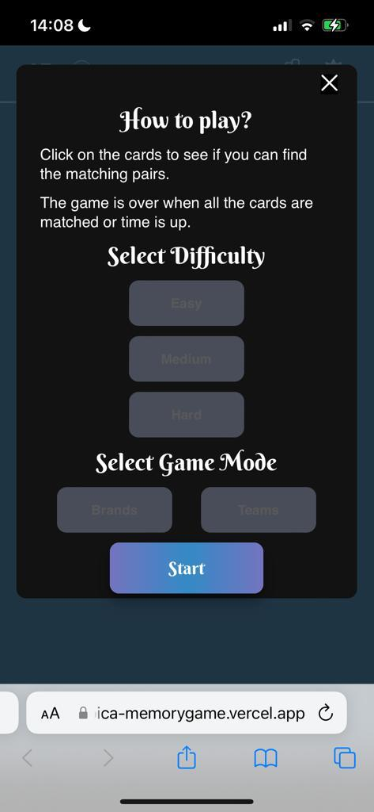

# Memory Game Project


## Table of Contents

* [Overview](#overview)
* [Selection Screen](#selection-screen)
* [Gameplay](#gameplay)
* [Player UI Feature](#player-ui-features)
* [Dependencies](#dependencies)
* [Installation and Operation](#installation-and-operation)
* [Contact](#contact)

## Overview

The Memory Game is a browser based game project that developed with React.

You can play the game here --> [Memory Game](https://qbica-memorygame.vercel.app/)

## Selection Screen

First you need to set the difficulty level of the game.

 - Easy (6 unique cards, 30 seconds, 3*4 grid on both Desktop and Mobile devices)

 - Medium (10 unique cards, 60 seconds, 4*5 grid on Desktop , 5\*4 grid on Mobile devices)

 - Hard (12 unique cards, 90 seconds, 4*6 grid on Desktop , 6\*4 grid on Mobile devices)

Then you can choose the type of logo you want to see and start the game. For now, there are only brand logos and England Premier League team logos options.



## Gameplay

Depending on the difficulty you choose, 6, 10 or 12 pairs of cards are displayed face down.

The objective of the game is to match all the pairs of cards.

When you click on a card, it will flip over and reveal a logo.

 - If the card is the same as the previous card, both cards will stay face up.

 - If the card is different from the previous card, both cards will flip back over.

 - If you click on a card that is already face up, the game will not flip the card over.

The game ends when all the pairs of cards are matched or time runs out.


## Player UI Features

In addition to the basic game play several UI components have been implemented
to provide the player with features to improve the overall experience.

* Move Counter - Displays the number of turns the player has taken, starting
with one at the first turn.

* Countdown - Countdown starts at 30, 60 or 90 seconds depending on the difficulty selected. The countdown is stopped when the player wins the game. When the countdown reaches zero, the game ends.

* Score -The score starts at zero , increases by 30, 40 or 50 depending on difficulty for each pair of cards matched and decreases by 5 for each turn where cards are not matched.

* Statistics - Displays the number of games played, the number of games won, the win rate, and the high score for each difficulty.

* Theme - Allows the player to change the theme to dark or light.


## Dependencies

This app has the following dependencies

 - React 18.1.0
 - Sass 1.51.0

## Installation and Operation

```
git clone https://github.com/qbica2/memorygame
npm install
npm start
http://localhost:3000/	
```

## Contact

 - [Github](https://github.com/qbica2)
 - [Linkedin](https://www.linkedin.com/in/kubilay-akdemir/)
 - [kubidik27@gmail.com](mailto:kubidik27@gmail.com)


